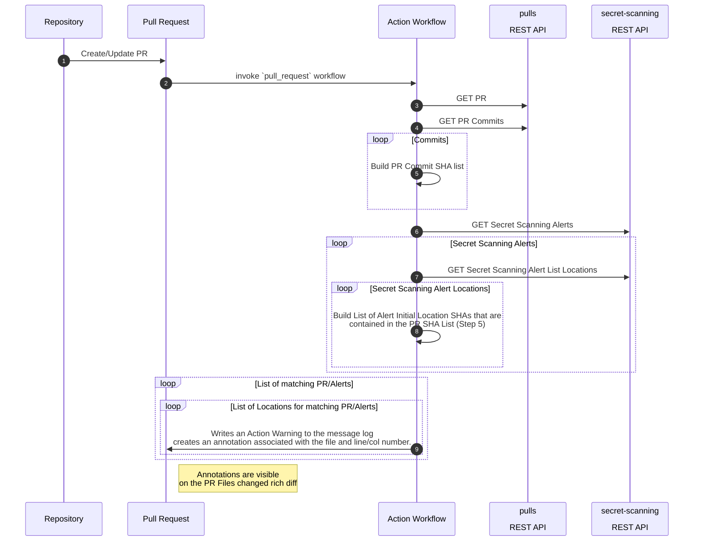

# secret-scanning-review-action
Action to detect if a Secret Scanning alert is initially detected in a PR commit

## Inputs

## `FailOnAlert`
**OPTIONAL** If provided, will fail the action workflow via non-zero exit code if a matching secret scanning alert is found. Default `"false"`.

## Outputs
N/A

## Example usage

```yml
name: 'Secret Scanning Review'
on: [pull_request]

jobs:
  secret-scanning-review:
    runs-on: ubuntu-latest
    steps:
      - name: 'Dependency Review'
        uses: felickz/secret-scanning-review-action@v0.0.6-alpha
        env:
            GITHUB_TOKEN: ${{ secrets.SECRET_SCAN_REVIEW_GITHUB_TOKEN }}
```

# Architecture
* PowerShell based script wrapped in a GitHub NodeJS action



## Secrets the action uses
* [GITHUB_TOKEN](https://docs.github.com/en/actions/security-guides/automatic-token-authentication#permissions-for-the-github_token) with repo scope or security_events scope. For public repositories, you may instead use the public_repo scope.

   * Unfortunately we cannot currently utilize the built in Actions `GITHUB_TOKEN` due to ommitted permissions on the `secret-scanning` api.  Therefore you must generate a PAT with these permissions, add the token as a secret in your repository, and assign the secret to the env variable in the workflow. See [Granting additional permissions](https://docs.github.com/en/actions/security-guides/automatic-token-authentication#granting-additional-permissions)
   * It is worth noting this PAT will have `sensitive` data access to return a list of plain text secrets that have been detected in your organization/repository.  At this point, a detected secret also implies any read repository access would provide the same level of access to the leaked secret.

## Environment variables the action uses
* Required
  * GITHUB_TOKEN - token used to invoke REST APIs
* Implicit
  * GITHUB_REPOSITORY - The owner / repository name.
  * GITHUB_REF - PR merge branch refs/pull/:prNumber/merge
* Optional
  * SSR_FAIL_ON_ALERT - overrides the FailOnAlert input 

## Dependencies
* GitHub Dependencies
    * GitHub [REST APIs](#rest-apis)
    * `pwsh-github-action-base` ([Repo](https://github.com/ebekker/pwsh-github-action-base)) PowerShell Actions Wrapper Template
        * by [@ebekker](https://github.com/ebekker/)
   
* Powershell Dependencies
    * `PowerShellForGitHub` ([Gallery](https://www.powershellgallery.com/packages/PowerShellForGitHub/0.16.1) / [Repo](https://github.com/Microsoft/PowerShellForGitHub)) - PowerShell wrapper for GitHub API
        * by [@microsoft](https://github.com/microsoft)
        * NOTE: [Telemetry is collected via Application Insights](https://github.com/microsoft/PowerShellForGitHub/blob/master/USAGE.md#telemetry)
    * `GitHubActions` ([Gallery](https://www.powershellgallery.com/packages/GitHubActions/1.0.0.3) / [Repo](https://github.com/ebekker/pwsh-github-action-tools)) - PowerShell wrapper of the Github `@actions/core` [toolkit](https://github.com/actions/toolkit/tree/master/packages/core)
        * by [@ebekker](https://github.com/ebekker/)


## REST APIs
* Pulls
   * https://docs.github.com/en/enterprise-cloud@latest/rest/pulls/pulls#get-a-pull-request
   * https://docs.github.com/en/enterprise-cloud@latest/rest/pulls/pulls#list-commits-on-a-pull-request
* Secret Scanning
   * https://docs.github.com/en/enterprise-cloud@latest/rest/secret-scanning#list-secret-scanning-alerts-for-a-repository
   * https://docs.github.com/en/enterprise-cloud@latest/rest/secret-scanning#list-locations-for-a-secret-scanning-alert

# FAQ

## Why Powershell
A few reasons
1. I was challanged by a coworker during a Python v PowerShell discussion
2. To demonstrate actions flexibility
3. Find current pitfalls and work with platform team to improve!