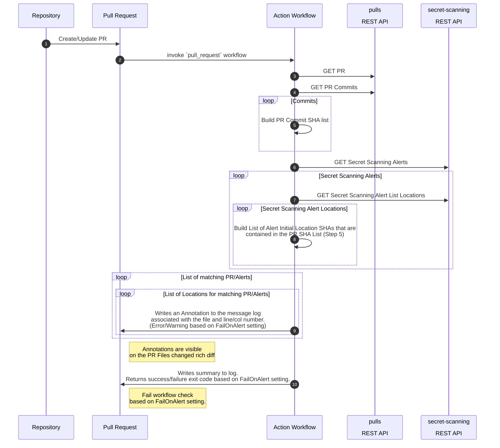

# secret-scanning-review-action
Action to provide feedback annotations to the developer when a Secret Scanning alert is initially detected in a PR commit.

The action is intended for private repositories that have GitHub Advanced Security licensed.

Adds a `Warning` annotation alert to any PR file that has introduced a secret (based on the secret scanning alert initial commit)


Workflow [FailOnAlert](#failonalert-environment-variable-ssr_fail_on_alert) configuration to turn those `Warnings` into `Errors`!


Allowing you additional secret scanning `trust->but->verify` control in your branch protection rules 


Summary of all secrets from the PR in the Secret Scanning Review workflow job summary


## Overview
This action is used to enhance the Advanced Security Secret Scanning experience with:
* Increased Alert Visibility
   * Secret Scanning alerts are only sent to [the commiter / Admin role](https://docs.github.com/en/enterprise-cloud@latest/organizations/managing-user-access-to-your-organizations-repositories/repository-roles-for-an-organization#access-requirements-for-security-features) dependent on [proper repo watch notification configurations](https://docs.github.com/en/enterprise-cloud@latest/code-security/secret-scanning/managing-alerts-from-secret-scanning#configuring-notifications-for-secret-scanning-alerts).  Alerts can also be configured to be async via email and may not be viewed in immediately. 
* Additional Alerting Scope
   * Increase visibility for secrets that are decected with [advanced security](https://docs.github.com/en/enterprise-cloud@latest/code-security/secret-scanning/secret-scanning-patterns#supported-secrets-for-advanced-security) but are not supported via [push protection](https://docs.github.com/en/enterprise-cloud@latest/code-security/secret-scanning/secret-scanning-patterns#supported-secrets-for-push-protection)
* Trust but Verify
    * Secrets that are initially prevented but have been forced into the Pull Request via [push protection bypass](https://docs.github.com/en/enterprise-cloud@latest/code-security/secret-scanning/protecting-pushes-with-secret-scanning#allowing-a-blocked-secret-to-be-pushed) can now be audited via [Branch Protection / Required Checks](https://docs.github.com/en/enterprise-cloud@latest/repositories/configuring-branches-and-merges-in-your-repository/defining-the-mergeability-of-pull-requests/about-protected-branches#require-status-checks-before-merging).

## Security Model Changes
* To be clear, this will make Secret Scanning Alerts visible to anyone with `Read` access to a repo [following the View code scanning alerts on pull requests](https://docs.github.com/en/enterprise-cloud@latest/code-security/code-scanning/automatically-scanning-your-code-for-vulnerabilities-and-errors/managing-code-scanning-alerts-for-your-repository#viewing-the-alerts-for-a-repository) via the workflow annotation access model.  This security control level is consistent with the access needed to see any raw secrets already commited to git history!

## Configuration Options

### `token` 
**REQUIRED** A GitHub Access Token
   * Classic Tokens
      *  repo scope or security_events scope. For public repositories, you may instead use the public_repo scope.
   * Fine-grained personal access token permissions
      * Read-Only - [Secret Scanning Alerts](https://docs.github.com/en/rest/overview/permissions-required-for-fine-grained-personal-access-tokens#secret-scanning-alerts)
      * Read-Only - [Pull requests](https://docs.github.com/en/rest/overview/permissions-required-for-fine-grained-personal-access-tokens#pull-requests). Not required for public repositories.

NOTE:
   * Unfortunately we cannot currently utilize the built in Actions [GITHUB_TOKEN](https://docs.github.com/en/actions/security-guides/automatic-token-authentication#permissions-for-the-github_token) due to ommitted permissions on the `secret-scanning` api.  Therefore you must generate a token (PAT or GitHub App) with these permissions, add the token as a secret in your repository, and assign the secret to the workflow parameter. See Also: [Granting additional permissions](https://docs.github.com/en/actions/security-guides/automatic-token-authentication#granting-additional-permissions)
   * It is worth noting this token will have `sensitive` data access to return a list of plain text secrets that have been detected in your organization/repository.  At this point, a detected secret also implies anyone with read repository access would provide the same level of access to the leaked secret and therefore should be considered compromised.

### `fail-on-alert`
**OPTIONAL** If provided, will fail the action workflow via non-zero exit code if a matching secret scanning alert is found. Default `"false"`.

### `fail-on-alert-exclude-closed`
**OPTIONAL** If provided, will handle failure exit code / annotations as warnings if the alert is found and the alert is marked as closed (state: 'resolved'). Default `"false"`.

## Outputs
N/A

## Example usage

**Please keep in mind that you need a [GitHub Advanced Security](https://docs.github.com/en/enterprise-cloud@latest/get-started/learning-about-github/about-github-advanced-security) license if you're running this action on private repositories.**

1. Add a new YAML workflow to your `.github/workflows` folder:

```yml
name: 'Secret Scanning Review'
on: [pull_request]

jobs:
  secret-scanning-review:
    runs-on: ubuntu-latest
    steps:
      - name: 'Secret Scanning Review Action'
        uses: felickz/secret-scanning-review-action@v0
        with:
          token: ${{ secrets.SECRET_SCAN_REVIEW_GITHUB_TOKEN }}
          fail-on-alert: true
          fail-on-alert-exclude-closed: true
```

# Architecture
* A GitHub [composite action](https://docs.github.com/en/actions/creating-actions/creating-a-composite-action) wrapping a PowerShell script.



## Environment Variables
* Implicit
  * GITHUB_REPOSITORY - The owner / repository name.
  * GITHUB_REF - PR merge branch refs/pull/:prNumber/merge
* Deprecated (previous inputs now supported via action workflow input parameters)
  * GITHUB_TOKEN - token used to invoke REST APIs
  * SSR_FAIL_ON_ALERT - overrides the `fail-on-alert` input parameter
  * SSR_FAIL_ON_ALERT_EXCLUDE_CLOSED - overrides the `fail-on-alert-exclude-closed` input parameter
* Outputs
  * GITHUB_STEP_SUMMARY - Markdown for each job so that it will be displayed on the summary page of a workflow run (unique for each step in a job)

## Dependencies
* GitHub Dependencies
    * GitHub [REST APIs](#rest-apis)
* Powershell Dependencies
    * `PowerShellForGitHub` ([Gallery](https://www.powershellgallery.com/packages/PowerShellForGitHub) / [Repo](https://github.com/Microsoft/PowerShellForGitHub)) - PowerShell wrapper for GitHub API
        * by [@microsoft](https://github.com/microsoft)
        * NOTE: [Telemetry is collected via Application Insights](https://github.com/microsoft/PowerShellForGitHub/blob/master/USAGE.md#telemetry)
    * `GitHubActions` ([Gallery](https://www.powershellgallery.com/packages/GitHubActions) / [Repo](https://github.com/ebekker/pwsh-github-action-tools)) - PowerShell wrapper of the Github `@actions/core` [toolkit](https://github.com/actions/toolkit/tree/master/packages/core)
        * by [@ebekker](https://github.com/ebekker/)

## REST APIs
* Pulls
   * https://docs.github.com/en/enterprise-cloud@latest/rest/pulls/pulls#get-a-pull-request
   * https://docs.github.com/en/enterprise-cloud@latest/rest/pulls/pulls#list-commits-on-a-pull-request
* Secret Scanning
   * https://docs.github.com/en/enterprise-cloud@latest/rest/secret-scanning#list-secret-scanning-alerts-for-a-repository
   * https://docs.github.com/en/enterprise-cloud@latest/rest/secret-scanning#list-locations-for-a-secret-scanning-alert

# FAQ

## Why Powershell
A few reasons
1. I was challanged by a coworker during a Python v PowerShell discussion
2. To demonstrate GitHub Actions flexibility ([pwsh is installed by default on the runners!](https://docs.github.com/en/actions/using-github-hosted-runners/about-github-hosted-runners#preinstalled-software))
3. Find current pitfalls and work with platform team to improve!
4. Powershell is cross-platform automation platform with the power of .NET!
